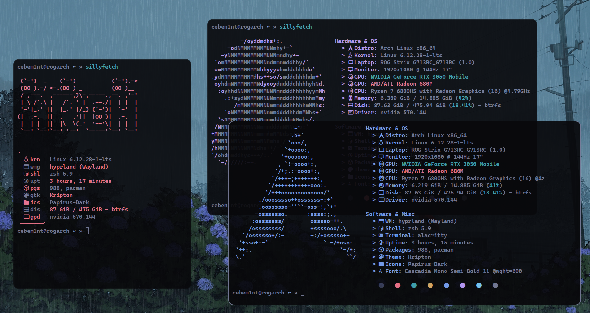

# Sillyfetch

Sillyfetch is a python neofetch clone/alternative call it however you want, with huge customizability.  

By the way, it has no dependencies which is weird for a python project :)

## Important

I'm sure this project has a whole bunch of bugs, so please lower your expectations. If you've find some, feel free to open an issue or fork it.

## Galery



Possible configuration


## Configuration

Sillyfetch is configured by python config file, which will be copied by default in `~/.config/sillyfetch/config.py`. 

Defualt config is the following:

```py
from datetime import date

def today():
    return date.today()

settings = {
    "layout": """
        {hostname()} {today()}
        Distro: {distro(architecture=True)}
        Uptime: {uptime(up=True)}
        Kernel: {kernel(small=False)}
        Shell: {shell()}
        Laptop: {model()}
        Monitor: {monitor()}
        CPU: {cpu()}
        GPU: {gpu()}
        WM: {wm()}
        Packages: {packages()}
        Driver: {gpu_driver()}
        Memory: {memory()}
        Theme: {gtk_theme()}
        Icons: {icon_theme()}

        {colors()}

    """,
    # Possible functions:
    #   uptime(up=False, length="full") 
    #   Returns uptime. If up is True, adds up in the beginning. Also can take length of the output. 
    #   Possible values for length are "full", "medium", "short"
    #
    #   distro(architecture=True)       
    #   Returns distribution name. Optionally shows architecture
    #
    #   model(version=True)             
    #   Returns model of the pc. Optionally shows the version of the model
    #
    #   shell(version=True)             
    #   Returns current shell in use. Optionally shows shell's version
    # 
    #   kernel(small=True)        
    #   Returns kernel version. Optionally returns smaller string
    #
    #   terminal()                
    #   Returns current terminal emulator
    #
    #   hostname()
    #   Returns hostname
    #
    #   packages()
    #   Returns package manager and amount of installed packages
    #
    #   de()
    #   Returns current desktop environment
    #
    #   wm(protocol=True)
    #   Returns current window manager. Optionally shows protocol (X11 or Wayland)
    #
    #   gtk_theme()
    #   Returns current GTK theme
    #
    #   icon_theme()
    #   Returns current icon theme
    #
    #   cursor_theme()
    #   Returns current cursor theme
    #
    #   gtk_font()
    #   Returns current font
    # 
    #   cpu(round_to=2, full_name=False, colorize=False)
    #   Returns CPU information. 
    #   By default rounds cpu speed to 2 decimal places
    #   If full name is set to True, Returns full name, for example: "AMD Ryzen 6000", If not, "Ryzen 6000"
    #   If colorize set to True, will color Intel CPU output to blue and AMD CPU output to red :) 
    #
    #   memory(GiB=True, round_to=3, colorize=True)
    #   Returns RAM usage info
    #   If GiB set to False, returns memory in MiB
    #   By default rounds memory to 3 decimal places
    #   If colorize set to True, colorizes usage percent to green
    #
    #   gpu(full_name=True, colorize=False)
    #   Returns GPU(s) info
    #   If full name is set to false, Will remove Nvidia or AMD or Intel
    #   If colorize is set to True, colorizes GPU name based on gpu vendor
    #
    #   gpu_driver(single_driver=True)
    #   Returns GPU Driver(s) in use info
    #   If single_driver is set to True, Returns only first GPU driver info
    #   
    #   colors(background=True, char="   ", normal_only=False)
    #   Prints cololors or colorized character
    #   If background is set to True, colorizes background instead of foreground
    #   If normal only is set to True, will not print bright collors  
    #   "char" is the character used to print colors
    #   
    #   disk(path='/', colorize=True, file_system=True, percent=True, round_mem_to=2)
    #   Returns Disk usage
    #   You can set another path, which will show the usage of some specific directory
    #   If percent is set to True, will show the percent usage
    #   If colorize set to True, colorizes percent usage to green
    #   By default rounds disk size to 2 decimal places
    #   
    #   monitor(refresh_rate=True, inch=True)
    #   Returns monitor info
    #   By default shows refresh rate and monitor size in inches
    #


    "custom_fetches": {
        "today": today
    },
    # dictionary with custom functions, if you want to display something yours
    # pass functions here, and insert them into layout as in example above 
    # format : 
    #     'function_name' : function 


    "colorize_functions" : True,
    # colorize function's output or no. if you want to insert specific color for the specific function output in line, then.
    # functions will be colored as text color if set to False. 
    # you have to set this param to False. This will disable colorizing for all the functions. you'll have to manually insert 
    # color for every function.to do that, you can use the following syntax: 
    # {cN}, where N is a number from 1 to 16. example:
    #
    # {c6} CPU: {cpu()}
    # 
    # example above will colorize all the line if colorize_functions set to false. 
    # if colorize functions set to True, then only "CPU: " will be colored.
    # 
    # colors are like in the example below. just past color number you want. for example:
    # {c6} colorize to magenta
    # {c2} colorize to red

    "text_color" : "logo", 
    # the color text will displayed with, text only, not result of functions
    # values :
    # 1   # black
    # 2:  # red
    # 3:  # green
    # 4:  # yellow
    # 5:  # blue
    # 6:  # magenta
    # 7:  # cyan
    # 8:  # white
    # 9:  # bright black
    # 10: # bright red
    # 11: # bright green
    # 12: # bright yellow
    # 13: # bright blue
    # 14: # bright magenta
    # 15: # bright cyan
    # 16: # bright white
    
    "functions_color": 8,
    # color of function's output, values are the same

    "logo" : "auto",
    # ascii logo to be displayed
    # values :
    #   'auto'    # automatically set logo 
    #   variable  # dictionary with custom ascii art
    #       example and format:

    #       from colorama import Fore as f
    #
    #       example_logo = {
    #           "logo" : f"""{f.RED}
    #               /\\,-'''''-,/\\
    #               \\_)       (_/
    #               |  {f.WHITE}"    "{f.RED}   |
    #               |   {f.WHITE}----{f.RED}    |
    #               ;           ;
    #               "'-_____-'"
    #               """,
    #           "main_color" : f.RED  # main color of the logo. you can use ansii codes or python colorama module
    #                                 # if logo is colorless leave it empy. if you have multicolored logo,
    #                                 # manually insert colors per line, and set this as main color of logo
    #       }
     
    #   distro names:   # if you want exact distro ascci art, pass distro's name
    #       Values:
    #       arch ubuntu debian fedora centos manjaro alpine linuxmint opensuse-leap kali parrot zorin
    #       slackware solus puppy tails rhel clear artix void opensuse-tumbleweed peppermintos gentoo

    "logo_info_whitespace" : 3,
    # lenght of whitespace between logo and information

    "lstrip_info" : False,
    # remove whitespaces at the beginning of every layout line 

    "print_logo": True,
    # Print logo or no

    "logo_position": "left",
    # position where logo located.
    #   values:  'left', 'top', 'right', 'bottom' 
}
```

# TODO

- [ ]  Code base is awful
- [ ]  Improve structure
- [ ]  Tests
- [ ]  Script with pyinstaller (maybe)
- [ ]  Multiplatform. Would be nice to see it on Windows